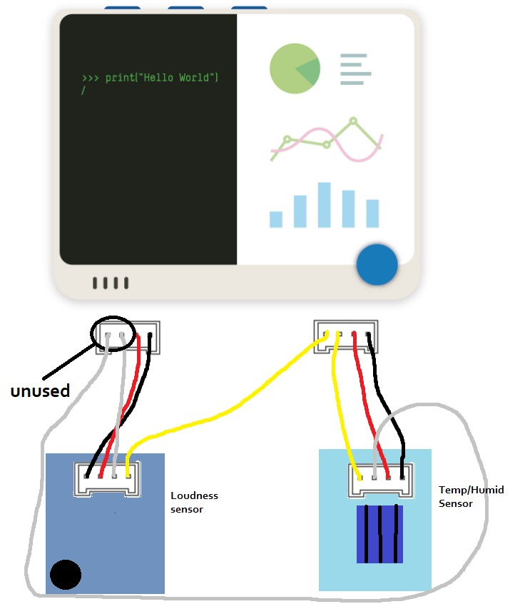

# StuWi Study Assistant

    

### Table of Contents
- [StuWi Study Assistant](#stuwi-study-assistant)
    - [Table of Contents](#table-of-contents)
    - [Purpose & Benefits](#purpose--benefits)
    - [System Design](#system-design-)
    - [Dependencies & Requirements](#dependencies--requirements)
        - [Hardware Components](#hardware-components)
    - [Installation](#installation)
    - [Usage](#usage)
    - [Video Demo](#video-demo)
    - [Team Members & Contributions](#team-members--contributions)
    - [Acknowledgements & Special Thanks](#acknowledgements-and-special-thanks)

*Study + Wio Terminal = 'StuWi'*

## Purpose & Benefits

StuWi study assistant is a system created for students or anyone engaged in cognitive work that wants to maximize focus and performance. With sensors providing details of the work environment that caters to the specific users needs, it ensures that the conditions for focused work are optimal.

StuWi’s desktop application aims to provide a user-friendly interface to monitor sensor values in real time and plan out study sessions with ease so that all effort can be put into doing valuable work. With persistent data storage to track progress and other analytics, StuWi helps the user further optimize how they work to reach their goals.

## System Design 
Last updated May 11, 2024

The system is divided in two Tiers: Wio Terminal (Tier 1) and a JavaFX Desktop Application (Tier 2) with a MongoDB Atlas cloud database.
The two tiers communicate with each other through a broker using the MQTT protocol, with a publish/subscribe architectural pattern.  
In the MQTT protocol, the 'publisher' sends messages to a specific topic of which the 'subscriber' subscribes. The MQTT broker mediates communication in its server by directing messages received by publishers to their desired topics and sending it out to the topic's subscribers.

The connection to MongoDB Atlas Database is made possible through the instance of a MongoClient that connects to the Atlas App Services wire protocol using a MongoDB connection string. The Atlas App Services protocol is a subset of the MongoDB wire protocol (TCP/IP).

Within the Desktop Application tier of the system, CRUD operations are made through the Data Access layer made up of Data Access Objects (DAO). Specific data processing is done within the business objects and service classes of the App backend.

## Dependencies & Requirements

This section outlines dependencies & requirements to run StuWi Study Assistant.

1. [Seeed Wio Terminal](https://wiki.seeedstudio.com/Wio_Terminal_Intro/)
2. [Arduino IDE](https://www.arduino.cc/en/software)
3. Wio Terminal Board Library. See: [Link](https://wiki.seeedstudio.com/Wio-Terminal-Getting-Started/#getting-started)
4. Following Arduino Libraries:
   - "Seeed Arduino rpcWiFi@1.0.6" by Seeed Studio (WiFi)
   - "PubSubClient@2.8" by Nick O'Leary (MQTT)
   - "Seeed Arduino RTC@2.0.0" by Seeed Studio (Built-in Real-Time CLock)
   - "ArduinoQueue@1.2.5" by Einar Arnason (Queue data structure)
   - "DHT sensor library@1.4.6" by Adafruit (DHT11 Temp/Humid)
5. Java SDK 21.0.2 [Download](https://www.oracle.com/java/technologies/javase/jdk21-archive-downloads.html)
6. [Apache Maven 4.0.0 Alpha](https://maven.apache.org/download.cgi)

Other libraries used exist natively in Arduino IDE & Seeed Wio Terminal Board library

### Hardware Components

**Microcontroller**
* [Seeed Wio Terminal](https://wiki.seeedstudio.com/Wio-Terminal-Getting-Started/)
* [Wio Terminal LCD](https://wiki.seeedstudio.com/Wio-Terminal-LCD-Overview/)

**Sensors:**
* [Loudness](https://wiki.seeedstudio.com/Grove-Loudness_Sensor/)
* [Temperature + Humidity](https://wiki.seeedstudio.com/Grove-TemperatureAndHumidity_Sensor/)

**Actuators:** 
* [Real-Time Clock (RTC)](https://wiki.seeedstudio.com/Wio-Terminal-RTC/)
* [Buzzer](https://wiki.seeedstudio.com/Wio-Terminal-Buzzer/)

## Installation

Before any steps below, clone or download the repo source code onto your local machine.

#### Wio Terminal

1. Install Arduino [IDE](https://www.arduino.cc/en/software)
2. Add Wio Terminal Board library to Arduino IDE See: [Link](https://wiki.seeedstudio.com/Wio-Terminal-Getting-Started/#getting-started)
3. Install required Arduino Libraries outlined in [Dependencies & Requirements](#dependencies--requirements) through searching by name in Library Manager of Arduino IDE. See how to install libraries: [Link](https://docs.arduino.cc/software/ide-v1/tutorials/installing-libraries/) 
4. Change variables 'SSID' & 'PASSWORD' in [wifi.cpp](src/wio-StuWi/src/stuwi_sketch_main/wifi.cpp) to your network SSID & Password in your local cloned/downloaded repo
5. Connect the sensors to the Wio Terminal according to following schema: 
6. Upload sketch to Wio Terminal. See step 5 in: [Link](https://wiki.seeedstudio.com/Wio-Terminal-Getting-Started/)

#### JavaFX Desktop Application

1. Download & install SDK 21.0.2 & Maven 4.0.0 outlined in [Dependencies & Requirements](#dependencies--requirements)
2. Run _mvn --version_ & _java --version_ in your machine's terminal to verify they've been installed correctly

## Usage
1. Connect the Wio Terminal to your computer using a USB-cable. Once the screen GUI interface shows up, the Wi-Fi has successfully connected. This may take a few seconds.
2. Using the command line terminal, navigate to the top directory of the application source code (where pom.xml is located).
3. Run the following line: **mvn javafx:run**
4. For instructions on how to navigate the StuWi application and its features, please see video demo below.

## Video Demo

[`StuWi Study Assistant` - Video Promotion](https://www.youtube.com/watch?v=zWGuKwf31Do)

## Team Members & Contributions

### Erik Nisbet @eriknis
#### Contributions:
* Maven setup
* MQTT Connectivity between devices
* Wio Source code structuring, emphasizing separation of concerns
* Re-usable sceneswitch function in JavaFX App
* RTC implementation (retrieve time on boot through NTP-service)
* Session processing logic in Wio Terminal (using RTC and queue datastructure)
* Buzzer & break notification implementation
* CI pipeline setup
* Hardware session initiation feature
* Unit testing
* Notable code-refactoring
* Graph analytics feature
* Small UI fixes
* Major README and Wiki contributions
* Creation & iterative updating of System Architecture Diagram
* Creation of releases 1.0, 1.5 and 2.0
* Heavily involved in planning, management & oversight of project
### Edvin Sanfridsson @edvsan 
#### Contributions:
* Sensor data reading for humidity and temperature
* MQTT handling with and topic/message parsing.
* Setting up JavaFX
* WIKI templates
* Session Configuration screen when starting a new session
* Ability to save session templates for later use
* Range settings screen when setting up thresholds
* Ability to save range settings.
* Updating ranges on the WIO terminal with Mqtt from settings and in the application
* Range threshold handling and notification on the WIO terminal.
* Saving/loading latest settings when closing and starting software
* WIO terminal UI
* Application CSS and UI
* Demo Video
* General bug fixing
### Johannes Borg @johabo
#### Contributions:
* Helped with Mqtt connection and setting up maven.
* Worked on and implementing the sensors.
* Done more work on loudness sensor together with @loveca (issue #8).
* Implemented notification feature when trespassing loudness threshold.
* Worked on and implemented the termination of study session through via hardware interface (hardware buttons) (issue #4).
* Been implementing a delete session button via session overview and improved the feature (issue #38).
* Refactored and "clean up" source code (examples of issues: #45, #46).
* Redesign some of StuWi GUI (example of issue: #47).
* Done multiple merge request and code reviews.
* Demo Video
* General bug fixing
### Love Carlander Strandäng @loveca
#### Contributions:
* Implemented the sensors and actuators
* MQTT handling topics/messages
* Implemented breaks for WIO terminal
* Implemented breaks for GUI/software
* Implemented notifications for user when a study session is over/a break starts/stops
* Quality of life improvements to GUI (example issue: 49)
* Refactoring, removing unnecessary methods/comments
* Redesign GUI (example issue: #36)
* CSS tuning for font styling
* General bug fixes
* Demo video
### Martin Lidgren @marlidg
#### Contributions:
* Setting up Maven for project
* MongoDB database connectivity
* Functionality for database interaction, i.e. DAO classes
* Back-end and frontend of the registration functionality
* Back-end and frontend of the login functionality
* Back-end logic for handling study session objects, like creation and deletion
* Study session manager for handling active sessions and collecting sensor data to be processed/saved
* User manager for keeping track of users
* Session dashboard back-end and frontend
* Session overview back-end and frontend
* Screen drawing functionality on the Wio Terminal to display sensor data
* Bug fixing

## Acknowledgements and Special Thanks

A special thanks goes to:

- Teaching Assistants Nasit Vurgun & Erik Lindstrand for their guidance and supervision over the course of this project's lifetime
- Course Examiner Francisco Gomes for creating the DIT113 course that teaches skills that the whole team found invaluable in terms of project workflow and development practices.
- Artist [Maura Keulen](https://www.linkedin.com/in/maurakeulen/) for helping bringing the [StuWi brand mascot and logo to life](/docs/images/StuWi-Transparent.png).
- Creators and maintainers of the numeours open source libraries utilized within this project.

